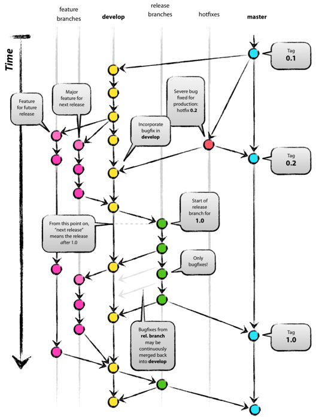

## Git 高级技巧及应用

### 一、基础命令隐藏技巧

- git clone --mirror (镜像)： 主要用于仓库迁移(常见不同托管平台)：实现仓库一比一完整迁移： 保留所有分支，提交历史、标签等

```shell 实践
  git clone --mirror <原仓库地址>
  cd repo.git

  git remote set-url origin <新仓库地址>
  git push --mirror
```

- git config优先级
  - 仓库配置 > 全局配置 > 系统配置
    - git config --global -e `编辑全局配置文件gitconfig文件: C:/Users/86178/.gitconfig`
    - git config --system -e `编辑系统配置文件gitconfig文件: C:/Program Files/Git/etc/gitconfig`
    - git config --local -e `编辑本地仓库配置文件: /projects/.git/config`
      > git config除了配置用户名、邮箱，还可以配置alias、editor、凭证等等
- git alias 命令行简化
  - simple
    - git config --global alias.co checkout `命令行配置; 逐个加`
    - git config --global -e `编辑gitconfig配置`
  - advance: 编辑.bash_profile进一步简化

    ```shell
     alias gco='git checkout'
     alias gsync='git pull; git push'
    ```

    > PS: 此时在git bash 中可以gco代替git checkout.

    ```js
    // goods alias
    [alias]
      co = checkout
      cob = checkout -b
      coo = !git fetch && git checkout
      lg = log --color --graph --pretty=format:'%Cred%h%Creset -%C(yellow)%d%Creset %s %Cgreen(%cr) %C(bold blue)<%an>%Creset' --abbrev-commit -n 20
      br = branch
      brd = branch -d
      st = status
      aa = add -A .
      unstage = reset --soft HEAD^
      cm = commit -m
      amend = commit --amend -m
      fix = commit --fixup
      undo = reset HEAD~1
      rv = revert
      cp = cherry-pick
      pu = !git push origin `git branch --show-current`
      fush = push -f
      mg = merge --no-ff
      rb = rebase
      rbc = rebase --continue
      rba = rebase --abort
      rbs = rebase --skip
      rom = !git fetch && git rebase -i origin/master --autosquash
      save = stash push
      pop = stash pop
      apply = stash apply
      rl = reflog
    ```

> PS: .bash_profile 默认在 C:/Users/86178/.bash_profile 路径下，没有就手动创建即可。

- git commit
  - git commit -am [message],跳过暂存区提交 等价于 git add -u + git commit -m
  - git commit --amend (结合Git add重写上次Commit History)
  - git commit --no-verify / -n [跳过校验，继续提交;结合 Git Hooks]

- git checkout
  - git checkout(theirs/ours选项): 并非自动完成提交,需要git add配合，常用于合并代码时选择别人的还是自己的。
  - git checkout --ours .
  - git checkout --theires .
  - git checkout [hash]用于临时测试，查看历史版本，此时Head为游离状态。

- git merge
  - git merge --no-ff `禁用fast-forward合并;强制创建一个合并提交;建议使用，保证各自提交历史完整，结构清晰`
  - git merge --squash `将合并结果压缩成一个commit提交到目标分支，代替合并提交，不会保留被合并的分支的历史记录;同时需要手动commit提交`
  - git merge -m [message] `修改默认合并提交信息`
  - git merge --abort `撤销合并` : 主要用于刚合并代码，未提交（commit），可以撤回合并。

### 二、git进阶命令

- git merge vs git rebase
  - git merge
    - fastForward / Three way Merge
    - merge策略：
      - Ort、Resolve、Recursive、Octopus、Ours、Subtree
  - git reabse (变基)
    - git rebase [baseBranch] [branchName]
    - git reabse -i [Hash]: `交互式变基：整理提交历史`
      - 作用: 提供一个交互式Vim窗口：rebase-todo待办列表(反序排列): 可以对过往Commit历史进行排序、压缩、合并、丢弃、编辑等。
        > PS: 其中比如edit可以结合 git add 和 git commit 和 git reabse --continue,将其中一个提交拆分成多个小提交;
    - git rebase -i HEAD~n: `整理最近N次提交历史`
      - simple situation
        - rebase过程中没有冲突。直接esc + :wq保存退出
      - complex situation
        - rebase 过程中，发生冲突，需要优先解决冲突; git add. + git rebase --continue,循环多次，直至解决所有冲突，才会终止 reabse 进程.
          > 注意： 如果 rebase 在 vim 窗口进程报错，记得 rm -rf /.git/rebase-merge
    - git reabse --onto选项
      - git rebase A^ B --onto [newBase] (默认情况，左开右闭，如果想包含 A,使用^)
      - git reabse --onto [newBase] [branch1] [branch2]
        > 检出 branch2，将 branch2 与 branch1 分叉后的 commits,移到 newBase 分支的顶端，在不依赖 branch1 分支的情况下
      - git rebase --onto [commitHashA] [commitHashB]: `用于移除当前分支的一些commits`
        > 如分支 A---B---C---D---E, 执行 git rebase --onto B D,此时 c,d 提交会被删除(左开右闭)

- git reset vs git revert
  - git reset
    - simple: 取消变更
      - git reset --hard: `取消所有变更`
      - git reset [path] `如取消文件路径下所有文件的变更： git reset './src'`
      - git reset HEAD [fileName] `取消单个文件的暂存`
    - advance: 重置回滚历史
      - git reset [--mixed/--soft/--hard/--keep/--merge] [hash]
        - mixed: reset Index, keep work
        - soft: keep work And Index,but reset Head
        - hard: reset Index And Work
    - 说明: 如果用hard模式去回滚,会丢掉当前commit后的所有commit历史，配合git reflog保命操作。较危险.如果推送远程，需用--force/-f 强制推送。
  - git revert
    - simple: 撤销非merge commit
      - git revert [Hash]: 撤销某次Commit,相当于一个反向的镜像，保留完整的提交历史，较安全。
    - advance: 撤销merge commit
      - git revert -m [parent-number] [Hash]: `选择主分支编号，进行revert`
- git subModule vs git subTree
  - git subModule: 用于管理子模块
  - git subTree: 用于管理子树
- git cherry-pick: 将指定范围的commit应用到当前分支。
  - git cherry-pick [hash]: `转移单个commit`
  - git cherry-pick [commitHashA commitHashB ...] `转移多个commit`
    > 注意: git cherry-pick 的 commit 会合到当前分支，生成对应的新的 commit
  - git cherry-pick A..B `转移A到B之内的所有提交，不包括A,且A必须早于B提交，否则失效，且不会报错`
  - git cherry-pick A^..B `转移A到B之内的所有提交,包含A`
  - git cherry-pick -m parent-number `选择主分支编号，进行cherry-pick`

- git stash(储藏): 用于临时保存工作进度
  - simple
    - git stash / git stash save / git stash push -m [message]
    - git stash list
    - git stash pop [stash-name]
    - git stash apply [stash-name]
    - git stash clear
    - git stash show [stash-name] / git stash show [stash-name] -p (查看更具体的stash内容)
  - advance - git stash branch [branchName] [stash-name]: 从储藏中签出一个分支 - git stash -u / --include-untracked: 储藏没有被Git追踪的文件 - git stash -a / --all: 储藏所有的文件，包含ignore的文件
    > PS: 注意drop与apply的区别。

### 三、Git提交规范 (Conventional Commits): 约定式提交：旨在规范你的Commit message信息。

- 约定式提交
  - Message 格式

  ```md
  <type>[optional scope]: <description>

  [optional body]

  [optional footer(s)]
  ```

  ```HTTP
    type只能是以下任意一种：
    feat：新增功能（feature）
    fix：修复缺陷（bug fix）
    docs：文档变更
    style：代码格式调整（不影响代码运行）
    refactor：代码重构（既不修复bug也不新增功能）
    perf：性能优化
    test：测试相关变更
    build：构建系统或外部依赖变更
    ci：持续集成配置变更
    chore：其他不影响源码的变更
    revert：回滚某个提交
    scope 作用范围
    description 描述信息
  ```

  > PS: type/description必填，其余可选，起源于Anglar规范

- Husky与Git Hooks: 约定代码规范和提交规范

```shell

  $ npx husky-init && npm install

  $ npm install --save-dev @commitlint/cli @commitlint/config-conventional

  $ npx husky add .husky/commit-msg 'npx --no-install commitlint --edit "$1"'

  $ git add .husky
  $ git commit -m "feat: add commitlint"
  $ git push
```

> Conventional Commits: https://www.conventionalcommits.org/en/v1.0.0/

### 四、Git Flow 工作流



### 五、Git GUI工具与插件(VSCode)

- GUI 工具
  - SourceTree: 界面干净清爽
  - GitKraken: 收费
  - Tortoise Git: 功能全,界面丑陋
  - gitK /git-gui (Git自带GUI界面)
  ```shell
    $ gitk or git-gui
  ```
- VSCode插件
  - GitLens: 鼠标悬浮可查看代码提交作者、提交时间
  - Git Graph： 图形化GUI工具
  - Git File History：方便查看文件过往历史时刻代码

### 六、推荐阅读

- **Git flight rules**: https://github.com/k88hudson/git-flight-rules/blob/master/README_zh-CN.md
- **Git-learning-playground**: https://learngitbranching.js.org/?locale=zh_CN
- **Git-doc** https://www.bookstack.cn/read/git-doc-zh/README.md
- **Git-tutorials** https://www.atlassian.com/git/tutorials/advanced-overview
